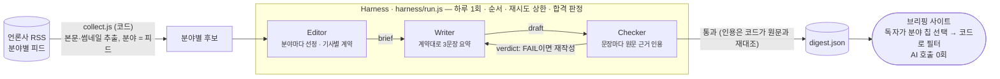

# Harness News

> 매일 아침 **시사 · 경제 · AI · 문화** 뉴스를 골라 3문장으로 요약하고, 썸네일 카드로 보여준다. 보고 싶은 분야는 독자가 고른다.
> 단, 요약의 **모든 문장은 원문의 어느 구절이 근거인지 검증을 통과해야** 실린다.

Anthropic 엔지니어링 글 [Harness design for long-running application development](https://www.anthropic.com/engineering/harness-design-long-running-apps)의
**Planner → Generator ⇄ Evaluator** 구조를 뉴스 브리핑 자동화에 적용했다. Claude Code headless(`claude -p`)만 쓰고, npm 의존성은 0개다.

## 왜 하네스가 필요한가 — 실제로 잡힌 것

AI 요약은 그럴듯하게 틀린다. 첫 테스트(haiku 모델, 프롬프트 튜닝 전, 영문 기사 1건)에서 Writer가 쓴 요약 6문장 중:

| 요약 문장 | 원문 | 결과 |
|---|---|---|
| "사이버보안·금융·법률 분야에서 **폐쇄형 최첨단 모델과 견주어도** 최고 수준" | 폐쇄형 모델을 넘어선 건 *visual grounding* 분야뿐 | ❌ Checker가 과장으로 잡음 |
| "활성 파라미터는 **49억** 개" | *49 billion* (= 490억) | ⚠️ **통과됨** — Checker 프롬프트로 막아야 할 숙제 |
| 다른 2문장 | — | ❌ Checker의 인용이 원문과 글자가 달라 **코드가 FAIL 처리** |

마지막 줄이 하네스의 핵심이다. Checker가 "근거 있음"이라고 말해도, 하네스는 그 인용이 원문에 **글자 그대로 있는지 코드로 다시 대조**한다.
LLM의 판정을 LLM의 말로만 믿지 않는다.

## 한눈에 보는 구조



**비싼 일(요약·검증)은 하루 한 번, 모두가 공유한다. 개인화(분야 선택)는 코드가 한다.**
그래서 방문자가 늘어도 AI 비용은 늘지 않고, 방문자가 AI를 호출할 길이 없으니 남용될 구석도 없다.

| 원문의 문제 | 이 프로젝트의 장치 | 코드 |
|---|---|---|
| 에이전트는 자기 결과물을 후하게 평가한다 | 쓰는 쪽(Writer)과 검수하는 쪽(Checker)을 **다른 프로세스**로 분리 | [`harness/agents.js`](harness/agents.js) |
| 평가자가 문제를 보고도 스스로 설득해 통과시킨다 | 합격은 **하네스가 계산**: 모든 문장의 인용이 원문에 실재해야 PASS | `check()`, `grounded()` |
| "완료"의 정의가 모호하다 | 쓰기 **전에** 기사마다 계약(브리프)을 정한다 | [`harness/contract.js`](harness/contract.js) |
| 외부 콘텐츠는 지시를 숨길 수 있다 (프롬프트 인젝션) | 모든 에이전트에 **도구 0개** (`--tools ''`). 원문은 데이터로만 전달 | [`harness/claude.js`](harness/claude.js) |
| 코드로 될 일을 모델에 맡기면 흔들린다 | 수집·분야 분류·합격 계산·필터·렌더링은 전부 **코드** | [`harness/collect.js`](harness/collect.js) |

## 직접 체험하기

**필요한 것:** Node.js 20+, 로그인된 [Claude Code](https://docs.claude.com/claude-code) (구독 또는 API 키 — 본인 계정으로 돌아간다)

```bash
npm run harness    # 오늘 기사 수집 → 분야별 선정 → 요약 ⇄ 검수 → digest.json 발행
npm start          # 사이트 → http://localhost:4400  (브리핑 · /process 하네스 과정)
npm run solo       # 비교군: 같은 기사로 분야마다 Claude에게 한 번에 "골라서 요약해줘"
```

같은 날 두 번 돌리면 같은 기사 스냅샷(`sources/<날짜>.json`)을 쓴다. `AUDIT=1`을 붙여 돌리면 발행 전에
**똑같은 감사**(계약 없이 근거만 검사)를 받고, 과정 페이지 상단에 `근거 없는 문장 n / 전체`로 비교된다.

> ⚠️ 하네스 1회 실행은 에이전트 호출이 수십 번이라 **사용량을 꽤 쓴다.** 가볍게 보려면 `HARNESS_MODEL=haiku npm run harness`.
> 참고로 solo 1회(haiku, 후보 44개, 호출 4번)는 2분 16초, API 정가 환산 $0.30이었다.

### 매일 자동으로

Windows 작업 스케줄러 (매일 08:00, 경로는 클론한 위치로):

```bat
schtasks /create /tn "HarnessNews" /sc daily /st 08:00 /tr "cmd /c cd /d C:\path\to\Harness-ToDo && npm run harness"
```

macOS/Linux는 `crontab -e`에 `0 8 * * * cd ~/Harness-ToDo && npm run harness`.

## 파일 지도

```
harness/
  run.js          메인 루프: 분야마다 선정 → 기사마다 요약 ⇄ 검수 → 발행
  solo.js         비교군: 하네스 없이 한 번에
  collect.js      분야별 RSS 수집, 본문·썸네일 추출 (AI 안 씀)
  agents.js       세 에이전트 = 프롬프트 + 입력 + 출력 스키마 + 합격 계산
  contract.js     계약(브리프) 양식 (JSON Schema)
  claude.js       claude -p 호출 한 곳
  digest.js       브리핑 페이지 (분야 칩 + 썸네일 카드, 스크립트 없음)
prompts/          editor.md · writer.md · checker.md — 각 에이전트의 태도와 기준
viewer/           사이트 서버 + 하네스 과정 페이지
runs/<id>/        한 번의 실행 기록 — events.jsonl, brief-<분야>.md, <기사id>/draft-N.md, check-N.md, digest.json
sources/<날짜>    그날 수집한 기사 원문 스냅샷 (커밋·공개하지 않음)
```

## 저작권

기사의 저작권은 각 언론사에 있다. 이 서비스는 **제목, 3문장 이내 요약, 원문 링크**만 공개한다.
본문은 공개하지 않고(`sources/`는 커밋하지 않음, `digest.json`에 본문 없음), 썸네일은 저장하지 않고 원문 주소로 표시한다.
공개 운영 전에 각 언론사 RSS 이용 약관을 확인할 것.

## 검증

```bash
npm test   # Claude 호출 없이: 본문·RSS 추출, 인용 대조, 브리핑 XSS 차단, 분야 필터·쿠키, 경로 탈출 차단
```

## 더 읽기

- [docs/architecture.md](docs/architecture.md) — 왜 이렇게 나눴나, 원문과의 대응, 일부러 뺀 것
- [AGENTS.md](AGENTS.md) — 이 저장소에서 일하는 코딩 에이전트를 위한 지도
