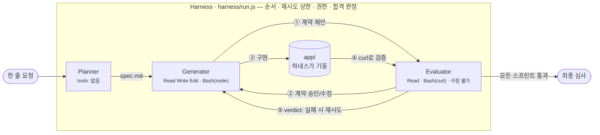

# Harness-ToDo

> 같은 한 줄 요청 — *"할 일 관리(ToDo) 웹 앱을 만들어줘"* — 을
> **에이전트 혼자** 만들 때와 **하네스 안에서** 만들 때, 무엇이 달라지는지 직접 돌려보고 눈으로 보는 프로젝트.

Anthropic 엔지니어링 글 [Harness design for long-running application development](https://www.anthropic.com/engineering/harness-design-long-running-apps)의
**Planner → Generator ⇄ Evaluator** 구조를 Claude Code headless(`claude -p`)만으로, 의존성 없이 수백 줄로 재현했다.

## 한눈에 보는 구조



| 원문의 문제 | 이 프로젝트의 장치 | 코드 |
|---|---|---|
| 에이전트는 자기 결과물을 후하게 평가한다 | 만드는 쪽(Generator)과 판정하는 쪽(Evaluator)을 **다른 프로세스**로 분리 | [`harness/agents.js`](harness/agents.js) |
| 평가자가 버그를 보고도 스스로 설득해 통과시킨다 | 합격은 LLM의 말이 아니라 **하네스가 계산**: 계약의 모든 항목이 pass여야 PASS | `evaluate()` |
| "완료"의 정의가 모호하다 | 구현 **전에** 완료 기준을 합의하는 **Sprint Contract** | [`harness/contract.js`](harness/contract.js) |
| 프롬프트로 "하지 마"라고 부탁해도 어긴다 | `--tools`로 **도구 자체를 안 준다** — Evaluator는 코드를 고칠 수 없다 | [`harness/claude.js`](harness/claude.js) |
| 긴 작업에서 맥락이 흐트러진다 | 매 호출이 새 세션. 에이전트끼리는 **파일로만** 대화 (`runs/<id>/`) | [`harness/log.js`](harness/log.js) |

## 직접 체험하기

**필요한 것:** Node.js 20+, 로그인된 [Claude Code](https://docs.claude.com/claude-code) (구독 또는 API 키 — 본인 계정으로 돌아간다)

```bash
npm run view       # 뷰어 열기 → http://localhost:4400 (실시간 갱신)
npm run solo       # ① 하네스 없이: Claude Code 한 번 호출로 만들고 "자기 보고"
npm run harness    # ② 하네스로: 스펙 → 스프린트별 계약 → 구현 ⇄ 검증 루프
```

두 실행은 마지막에 **똑같은 숨겨진 기준**([`harness/acceptance.json`](harness/acceptance.json) — 빈 입력, 없는 id, 깨진 JSON, XSS 등)으로
같은 Evaluator에게 채점받는다. 뷰어에서 둘을 번갈아 보며 비교하면 된다:

- solo의 `report.md`(자기 보고: "완료")와 `acceptance/verdict.md`(독립 심사)가 어떻게 다른지
- harness에서 Evaluator의 FAIL이 Generator의 다음 시도에 어떻게 반영되는지 (`sprint-N/attempt-K/`)
- 각 에이전트 카드의 `권한거부` 횟수 — 허락되지 않은 행동을 시도했다가 막힌 흔적

> ⚠️ 하네스 1회 실행은 에이전트 호출이 수십 번이라 **구독 사용량을 꽤 쓴다.** 먼저 가볍게 보려면
> `HARNESS_MODEL=haiku npm run harness` 처럼 모델을 지정할 수 있다. 뷰어의 "비용 환산"은 API 정가 기준 추정치다.
>
> 실행 없이 보려면 `runs/demo-*` 녹화본을 뷰어에서 고르면 된다.

## 파일 지도

```
harness/
  run.js          메인 루프 (Planner → 스프린트마다 계약 협상 → 구현 ⇄ 검증)
  solo.js         비교군: 하네스 없이 한 번에
  agents.js       세 에이전트 = 시스템 프롬프트 + 권한 + 출력 스키마
  contract.js     Sprint Contract 양식 (JSON Schema)
  claude.js       claude -p 호출 한 곳. 권한 플래그가 모여 있는 곳
  app.js          생성된 앱을 하네스가 띄우고 내림
  acceptance.json 최종 심사 기준 (만드는 쪽에는 보여주지 않음)
prompts/          planner.md · generator.md · evaluator.md — 각 에이전트의 태도와 기준
viewer/           runs/ 를 읽는 실시간 타임라인 + 구조도 (의존성 없음)
runs/<id>/        한 번의 실행 기록 — events.jsonl, spec.md, sprint-N/…, app/
docs/             설계 근거 → docs/architecture.md
```

## 검증

```bash
npm test   # Claude 호출 없이 배관 검증: 앱 기동/종료, 뷰어 경로 탈출 차단
```

권한 강제(Evaluator가 파일을 못 만드는지)는 실제 `claude -p` 호출로 확인했다 — 파일 생성 시도 2회 모두 거부됨.

## 더 읽기

- [docs/architecture.md](docs/architecture.md) — 왜 이렇게 나눴나, 원문과 다른 점, 일부러 뺀 것
- [AGENTS.md](AGENTS.md) — 이 저장소에서 일하는 코딩 에이전트를 위한 지도
